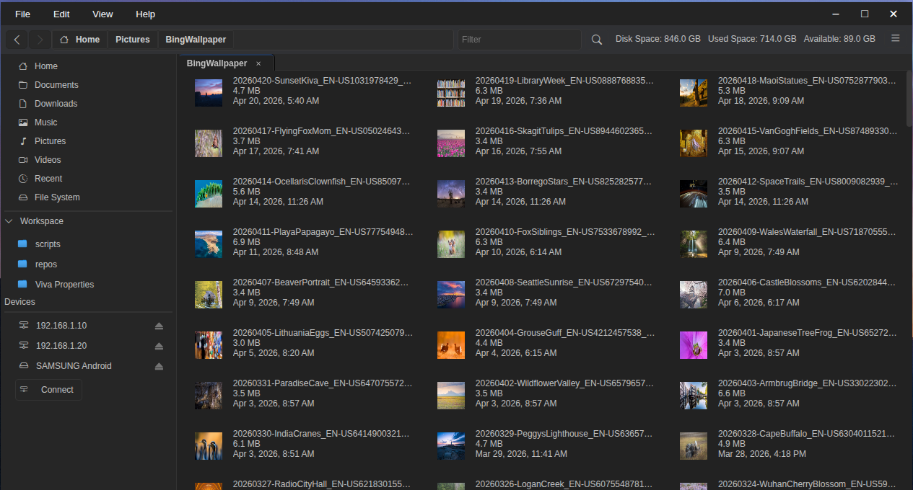
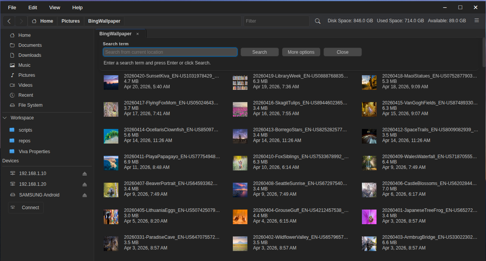
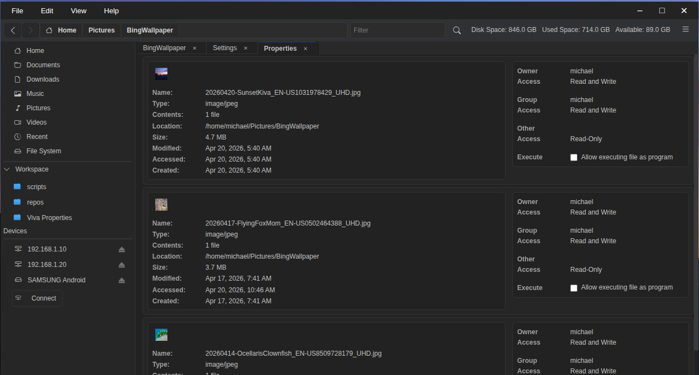
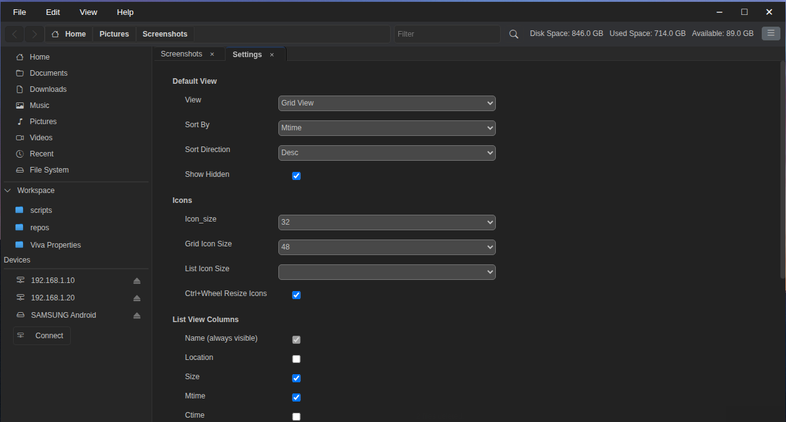
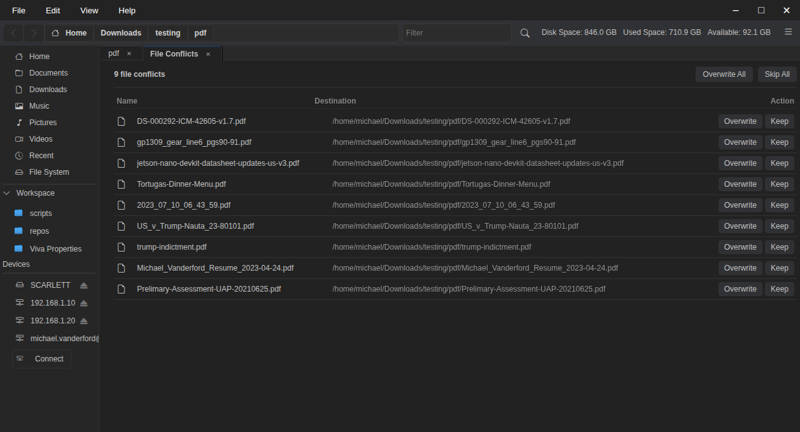

# SFM — Simple File Manager

> A fast, keyboard-friendly file manager for Linux, built with Electron and native GIO bindings.

---


## Screenshots

<div align="left">
	
	
	
	
	<!--  -->
</div>

---

## Features

### Navigation
- **Multi-tab browsing** with persistent tab history and back / forward navigation
- **Breadcrumb bar** with inline location input and path autocomplete
- **Sidebar** with quick links to Home, Documents, Downloads, Music, Pictures, Videos, Recent Files, and File System root
- **Recent files** view

### File Operations
- **Copy, cut, paste** files and folders
- **Drag-and-drop** to move or copy between locations (hold `Ctrl` to copy)
- **Rename** files and folders inline
- **Create** new folders
- **Delete** files and folders
- **Overwrite conflict resolution** — choose to replace or skip per file

### Views & Sorting
- **List view** and **Grid view**
- Configurable **columns** (name, size, modified, created, accessed, type, path, count)
- Resizable columns with persistent widths
- **Sort** by name, size, modified, created, or accessed — ascending or descending
- **Filter** files by name in the current view
- **Show / hide hidden files**

### Selection
- **Click**, **Ctrl+click**, and **Shift+click** selection
- **Drag-select** with a rubber-band rectangle
- **Auto-scroll** when dragging near the top or bottom edge of the view
- **Select all** (`Ctrl+A`)

### Compression & Archives
- **Compress** selected files to `tar.gz`, `tar.xz`, or `zip`
- **Extract** archives in place
- Progress indicator with cancel support

### Network & Devices
- **SSHFS** and **SSH** connections (public key or password authentication)
- **SMB / Windows Share** connections
- **Mount and unmount** drives and removable media
- **MTP** mobile device support (phones, tablets)
- **Disk usage indicator** per device in the sidebar
- **Connect to Network** button in the Devices panel

### Workspace Bookmarks
- **Pin folders** to the Workspace sidebar for quick access
- Rename, remove, and reorder bookmarks
- Folder icons displayed per bookmark

### File Properties
- Size, permissions, MIME type, timestamps, and more
- **Folder size** calculation in the background

### Icons & Thumbnails
- System-resolved file and folder icons via native GIO
- **Lazy-loaded icons** for large directories
- Resizable icons (`Ctrl+Wheel`)

### Settings
- View preference (list / grid)
- Default sort order and direction
- Startup location
- Disk utility application
- Show / hide hidden files
- Icon sizes (grid and list independently)

### Keyboard Shortcuts

| Action | Shortcut |
|---|---|
| New folder | `Ctrl+Shift+N` |
| Cut | `Ctrl+X` |
| Copy | `Ctrl+C` |
| Paste | `Ctrl+V` |
| Rename | `F2` |
| Delete | `Delete` |
| Select all | `Ctrl+A` |
| Open in new tab | `Ctrl+T` |
| Navigate back | `Alt+Left` |
| Navigate forward | `Alt+Right` |
| Go to location | `Ctrl+L` |

---

## Requirements

- Linux (x86-64)
- Node.js ≥ 18
- `sshfs` (optional, for SSHFS network mounts)

---

## Installation

```bash
git clone https://github.com/michael-vanderford/sfm.git
cd sfm
npm install
npm start
```

---

## Build

Produces a `.deb` package for Debian / Ubuntu:

```bash
npm run build
```

Output is written to the `dist/` directory.

---

## Tech Stack

| Component | Technology |
|---|---|
| Shell | Electron |
| Native FS / Icons | GIO (custom N-API addon) |
| Icons | Bootstrap Icons |
| Workers | Node.js Worker Threads |
| Tests | Jest |

---

## Contributing

Contributions, issues, and pull requests are welcome.
Please open an issue first to discuss significant changes.

---

## License

Licensed under the **GNU Lesser General Public License v2.1 or later** (LGPL-2.1-or-later).
See [LICENSE](LICENSE) for details.

---

## Author

**Michael Vanderford** — [michael.vanderford@gmail.com](mailto:michael.vanderford@gmail.com)
[https://github.com/michael-vanderford/sfm](https://github.com/michael-vanderford/sfm)